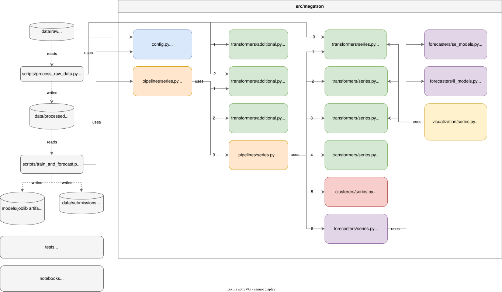

<!-- markdownlint-disable MD033 MD041 -->

<p align="center">
  
</p>

<p align="center">
  <a href="#quick-start"></a>
  <a href="#architecture"></a>
  <a href="#tests"></a>
</p>

# Megatron

<p align="justify">
<code>megatron</code> is a Python package that provides a toolkit with multithreading capability for processing, clustering and forecasting large collections of time series. It also proposes an orchestration structure to perform an end-to-end workflow.
</p>

## Project

### From curiosity to clear goal

<p align="justify">
It was originally intended to take part in <a href="https://www.kaggle.com/competitions/store-sales-time-series-forecasting">Kaggle</a> retail time series forecasting competition and keep a manually driven notebook solution. However as the solution grew it was rebuilt to a more reliable, automated and scalable version. Thus the purpose became obvious &mdash; create a production-oriented framework for large real data capability.
</p>

### Core capabilities

<div align="justify">
<p>Package components are almost designed to work with hierarchically structured time series e.g. <code>(store_id, product_id, date)</code> and submit:</p>
  <ul>
    <li>series frequency recovery, missing values imputation, etc.;</li>
    <li>series demand classification;</li>
    <li>demand-specific transformations such as plateaus, change point and outliers detection;</li>
    <li>demand-specific clustering strategies;</li>
    <li>demand and cluster size specific forecasting strategies;</li>
    <li><code>optuna</code> parameters tuning with time series cross validation.</li>
</div>

## Quick start

### Installation

Workflows are managed with [Hatch](https://hatch.pypa.io/). Install it once globally:

```bash
pipx install hatch
```

Hatch creates and reuses isolated environments per task on demand &mdash; no manual `.venv` activation needed. The first invocation of any `hatch run ...` command resolves runtime dependencies from `pyproject.toml` and installs the matching env (`default`, `test`, `lint`, or `notebook`).

Supported Python versions: **3.13**:

```bash
hatch python install 3.13
```

Optionally enable git pre-commit hooks (auto-format, lint, strip notebook outputs):

```bash
hatch run precommit:install
```

### Data setup

Place the expected raw CSV files from <a href="https://www.kaggle.com/competitions/store-sales-time-series-forecasting">Kaggle</a> competition into `data/raw` directory before start.

### Run

End-to-end pipeline:

```bash
hatch run fit-all
```

Stepwise equivalent:

```bash
hatch run process    # raw CSV -> processed parquet
hatch run forecast   # processed parquet -> models + submission
```

<div align="justify">
<p>After a successful run, the repository essentially complements with:</p>
  <ul>
    <li>processed parquet files in <code>data/processed</code>;</li>
    <li>binary serialized clusterers and forecasters in <code>models</code>;</li>
    <li>latest forecast CSV file in <code>data/submissions</code>.</li>
</div>

### Tests

The test suite is split into three layers:

- unit &mdash; checks the individual components computational logic;
- integration &mdash; checks how package components work together;
- data_quality &mdash; validates processed dataset characteristics.

```bash
hatch run test:fast          # unit + integration with coverage
hatch run test:data-quality  # data-quality checks without coverage
hatch run test:all           # everything

hatch run test:unit          # unit only
hatch run test:integration   # integration only
hatch run test:cov-html      # coverage as a browseable HTML report
```

Code style:

```bash
hatch run lint:check  # ruff format --check + ruff check, report only
hatch run lint:fmt    # ruff format + ruff check --fix, write changes
```

### Notebooks

Three exploratory notebooks live under `notebooks/`. To run them, register the Hatch `notebook` env as a Jupyter kernel once:

```bash
hatch run notebook:register-kernel
```

Then in VS Code (or Jupyter Lab) select **kernel (Python 3.13.11)** as the notebook's kernel.

## Architecture

<p align="justify">
The common pipeline follows two main stages &mdash; convert raw retail data into aligned processed artifacts and train a forecasting pipeline to export predictions.
</p>



### Repository layout

```text
.
├── data/
│   ├── raw/                  # input CSV data
│   ├── processed/            # parquet raw processed data
│   ├── submissions/          # final forecast CSV output
│   └── test/                 # parquet synthetic and train sliced samples
├── docs/                     # graphic content
├── models/                   # persisted reusable objects
├── notebooks/                # disclose stepwise workflow notebooks
├── scripts/
│   ├── process_raw_data.py   # raw to processed data running script
│   └── train_and_forecast.py # processed data to fitted models and forecast running script
├── src/megatron/
│   ├── clusterers/           # series clustering structures
│   ├── forecasters/          # forecasting structures amd model instances
│   ├── pipelines/            # end-to-end orchestration modules
│   ├── transformers/         # preprocessing and feature extraction structures
│   ├── visualization/        # custom plotting modules
│   └── config.py             # global runtime configuration via constants
├── tests/
│   ├── unit_test.py
│   ├── integration_test.py
│   └── data_quality_test.py
└── pyproject.toml
```

## Pleasant notes

<p align="justify">
The e2e runtime workflow from raw data to final forecast was about <code>3h 56min</code> and performed on <code>Macbook Air (M2, 2022)</code> with <code>8GB RAM</code> and <code>8-core CPU</code>. Therefore instead of fitting a forecaster per series (<code>1638</code> time series in total) it was only necessary to successfully fit <code>4</code> clusterers and <code>54</code> forecasters.
</p>

By the way, as of latest <a href="https://www.kaggle.com/competitions/store-sales-time-series-forecasting">Kaggle</a> submission the result is placed in leaderboard top `7%` :scream: :exploding_head:

## Further steps

<div align="justify">
  <p>Here're several orchestration and computational structure enhancements to work on:</p>
    <ul>
      <li>tryout other clustering algorithms beyond <code>KMeans()</code>, so the more clusters are homogenous the better global models quality in average is;</li>
      <li>add several DL-algorithms to comparison on giant clusters global forecasting;</li>
      <li>instead of multithreading usage within each demand class separately redesign structure in purpose of fitting models per cluster as much as available threads regardless its demand class, thus there're no free threads til the end of training;</li>
      <li>unload the local machine attempting to link the remote servers for global models training, therefore its possible to accelerate process instantly with an external number or threads;
      <li>add more unit and integration tests with an eye to cover the remaining modules and decrease the vulnerability in overall accordingly.</li>
</div>
